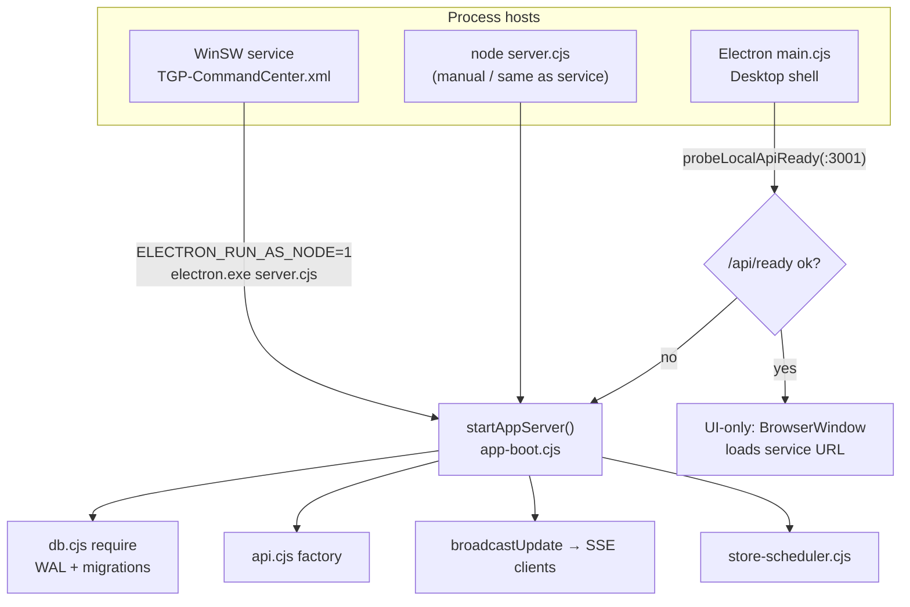

# TGP Command Center — Architecture Map (Peer Review)

Hyper-detailed map for programmers. Paths are under `C:\Users\SMS\Desktop\TGPV5\TGP_V5\resources\app` unless noted.

---

## 1. Process model: Electron ↔ headless ↔ WinSW



### Entry points

| Host | File | Role |
|------|------|------|
| Electron desktop | `main.cjs` | Single-instance lock, `BrowserWindow`, attach-or-serve |
| Headless API | `server.cjs` | Sets `TGP_DATA_DIR`, `TGP_SERVICE=1`, PID lock, then boots |
| Windows service | `service/TGP-CommandCenter.xml` | Runs Electron as Node on `server.cjs` |

### Shared boot: `src/lib/app-boot.cjs`

**Exports:** `startAppServer`, `probeLocalApiReady`, `defaultLog`

**`startAppServer({ appRoot, log, onForceRefresh, onListenError })` owns:**
1. `require('../db.cjs')` — opens SQLite, runs migrations at module load
2. Boot WAL: `PRAGMA wal_checkpoint(TRUNCATE)`
3. Express app: CORS, JSON 10mb, rate limits, static + React portals, SSE, TV
4. `apiFactory(...)` from `src/api.cjs`
5. Schedulers via `createStoreSchedulers` (`src/lib/store-scheduler.cjs`)
6. EOD catch-up: `catchUpMissedSweeps`
7. Optional HTTPS via `ensureLocalHttpsCredentials` (`src/lib/local-https.cjs`)
8. Returns `{ listener, httpsListener, networkConfig, localAppUrl, getBootHealth, close }`

### Electron attach-or-serve (`main.cjs`)

- `resolveLocalAppUrl()` → `probeLocalApiReady(port)` hits `GET /api/ready`
- If ready → `uiOnlyMode = true`, window loads service; **does not** call `runtimeClose` on quit
- If not ready → `startAppServer({ onForceRefresh })` — Electron IPC `force-refresh` mirrors SSE deltas into the shell
- Single-instance: `app.requestSingleInstanceLock()`

### WinSW (`service/TGP-CommandCenter.xml`)

- **Executable:** `node_modules/electron/dist/electron.exe`
- **Args:** `server.cjs`
- **Env:** `ELECTRON_RUN_AS_NODE=1`, `TGP_SERVICE=1`, `TGP_DATA_DIR` → install root
- **Why Electron binary:** `better-sqlite3` is built for Electron ABI 145 (see `db.cjs` error tip). Service is *not* system Node.
- Template: `service/TGP-CommandCenter.xml.template`; install rewrites paths via `service/Install-TGP-Service.ps1`

### Headless extras (`server.cjs`)

- Default `TGP_DATA_DIR` = `path.resolve(appRoot, '..', '..')` (install root)
- `acquireProcessLock` / `releaseProcessLock` (`src/lib/process-lock.cjs`) → `tgp-server.lock` under data root
- SIGINT/SIGTERM → `runtime.close()` then unlock

### Data paths (`src/paths.cjs`)

| Helper | Default |
|--------|---------|
| `getDataRoot()` | `TGP_DATA_DIR` or `dirname(execPath)` |
| `getDbPath()` | `{dataRoot}/tgp_ops.db` |
| `getPulseInventoryDbPath()` | `{dataRoot}/data/pulse_inventory.db` |
| `getLogPath()` | `{dataRoot}/tgp_error.log` |

### Architectural risks (process)

1. **Two ownership models for :3001** — service PID lock vs Electron single-instance; race if both try to bind between probe and listen (`EADDRINUSE` path in `onListenError`).
2. **ABI lock-in** — service *must* use `ELECTRON_RUN_AS_NODE`; `npm run rebuild:node` alone breaks the service.
3. **UI-only quit leaves API up** — correct by design, but confusing if operators expect closing the .exe to stop phones/TV.
4. **DB open at `require('db.cjs')`** — migrations run on first import before listen; a second process that loses the port race may still touch the DB briefly.

---

## 2. Request path: Express registration & middleware

### Assembly order in `startAppServer`

1. `cors({ origin: isAllowedCorsOrigin(...) })` — `src/lib/network-config.cjs`
2. `express.json({ limit: '10mb' })`
3. Permissions-Policy header (camera for `/count`)
4. **Unauthenticated** `GET /api/ready` — deploy fidelity + HTTPS info
5. **`/api/` rate limit** — 200/min (10k in test modes)
6. React SPA + legacy 301s + static
7. **`/api/mobile-auth` rate limit** — 5 / 15 min (stricter)
8. Stream token + SSE (before full API)
9. `apiFactory(server, db, auth, broadcastUpdate, ...)` → route registrars
10. Express error middleware inside `api.cjs`

### Route registration (`src/api.cjs` factory)

```text
registerCoreRoutes      → src/routes/core.cjs
registerSyncRoutes      → src/routes/sync.cjs
registerActionRoutes    → src/routes/action.cjs
registerReportsRoutes   → src/routes/reports.cjs
registerBetacsRoutes    → src/routes/betacs.cjs
registerPresenceRoutes  → src/routes/presence.cjs
registerManagerRoutes   → src/routes/manager/index.cjs
  (devices, ops, maintenance, audits, order-audit, comms,
   daily-direction, safety, receiving, safety-inspections,
   inventory-count, incident-investigations)
```

`src/routes/manager.cjs` is a thin re-export of `manager/index.cjs`.

### Auth surface

| Endpoint | File | Notes |
|----------|------|-------|
| `POST /api/mobile-auth` | `core.cjs` | PIN login; authLimiter |
| `POST /api/logout` | `core.cjs` | |
| `GET /api/health` | `core.cjs` | |
| Session API | `src/auth.cjs` | `createSession`, `getSession`, `destroySession`, `cleanupSessions`, `migrateStaffPins` |

**`requireSession` / `requireShiftLead` / `checkSettingPermission`** live in `api.cjs` and are injected into route ctx.

**Token sources:** `x-session-token` header **or** `body.token` (parity trap called out in rules).

**Sessions:** SQLite `sessions` table (migration `046_persistent_sessions.cjs`); 12h idle timeout; role re-read from `staff` on every `getSession`.

### Device / PoC auth

- `findAuthorizedTrustedDevice` — `src/lib/trusted-device-tokens.cjs`
- `isTokenlessStoreModeEnabled` — `src/lib/poc-access.cjs`
- Used on SSE, TV `/tv`, and sync audience when no staff session

### CORS / network

`buildNetworkConfig(settings, env)` reads `Allow_LAN_Clients`, `LAN_Bind_Host`, `LAN_Port`, HTTPS flags. Default bind `0.0.0.0:3001`.

### Architectural risks (HTTP)

1. **Generic `POST /api/action`** — large mutation surface; permission logic concentrated in `src/actions/handlers.cjs` (~729 lines).
2. **Auth limiter only on `/api/mobile-auth`** — other endpoints rely on session + generic API limiter.
3. **Token in body** — CSRF-ish exposure on LAN; intentional for legacy clients, still a footgun.
4. **Tokenless LAN mode** — PoC shortcut that widens TV/SSE access when enabled.

---

## 3. Data layer

### Wrapper: `src/db.cjs`

**Open:** `better-sqlite3` on `getDbPath()`

**PRAGMAs:**
- `journal_mode = WAL`
- `busy_timeout = 5000`
- `foreign_keys = ON`
- `synchronous = NORMAL`
- `cache_size = -24000` (24 MB)

**API surface:**
- `db.all/get/run/exec/transaction`
- LRU prepared-statement cache (`getStmt`, cap 256)
- Helpers: `getSettings`, `getCounts`, `findStaffByName`, hardware order helpers, `isFlagOn`, `backup`, `close`
- Module also embeds large `CREATE TABLE IF NOT EXISTS` bootstrap, then runs numbered migrations

### Migrations

| Fact | Value |
|------|--------|
| Count | **46** files `001`–`046` (contiguous) |
| Runner | `src/migrations/runner.cjs` — `runMigrations`, `listMigrationFiles`, `getPendingMigrations` |
| Latest | **`046_persistent_sessions.cjs`** — `sessions` table |
| Tracking | `schema_version(version, applied_at, name)` |
| Safety | `createPreMigrationSnapshot` (`src/lib/migration-safety.cjs`) before applying pending |

Each migration: `module.exports = { name, up(db) }`.

### Settings key-value pattern

**Table:** `settings(setting_name PRIMARY KEY, setting_value TEXT)`

| Pattern | Location |
|---------|----------|
| Bulk read object | `db.getSettings()` → `{ [name]: value }` |
| Single upsert | `upsertSetting` — `src/lib/settings-store.cjs` |
| Batch (max 40) | `applySettingsBatch` — `src/lib/settings-batch.cjs` |
| Seed defaults | `initializeSettings()` in `db.cjs` (INSERT OR IGNORE) |
| Feature flags | `flag.{name}` via `db.isFlagOn(name)` |
| Write ACL | `CLERK_WRITABLE_SETTINGS` / `MANAGER_WRITABLE_SETTINGS` — `src/constants/api-settings.cjs` |
| Redaction | `SENSITIVE_SETTING_KEYS` (TV key, presence gateway secrets) |
| JSON blobs | Zone maps, FIFO aisles, schedule buckets — validated in batch |
| Blocked from batch | `Order_Start`, `Order_End`, `Active_Manager` |

Boot also calls `initializeDailyRhythm()` → template seed from `store-templates/`.

### Secondary DB

Pulse inventory count: `src/lib/pulse-inventory-db.cjs` → separate file via `getPulseInventoryDbPath()`.

### Architectural risks (data)

1. **Schema dualism** — bootstrap CREATE + migrations; easy to add columns in one place only.
2. **WAL + NORMAL** — crash window vs FULL; mitigated by checkpoints on boot/weekly backup.
3. **Statement cache + long-lived process** — fine for service; schema changes mid-process need care.
4. **Settings as stringly-typed KV** — JSON settings parsed ad hoc; typos become silent defaults.
5. **Single-file SQLite** — all portals contend; EOD/rhythm/sync share one writer path.

---

## 4. Sync contract

### Build: `assembleSyncPayload` — `src/dal/sync-payload.cjs`

**Route:** `GET /api/sync` via `registerSyncRoutes` (`src/routes/sync.cjs`)

Side effects before assemble:
- `ensureKillDatePullTasks` / `broadcastPullTaskEvents`
- `maybeEnsureMorningRhythm` (authenticated sync-heal)

**Audience:** `resolveSyncAudience(session)` → `'public' | 'staff' | 'manager' | 'tv'`

| Audience | How | Payload highlights |
|----------|-----|-------------------|
| **public** | No session | Login staff (role+permissions), redacted settings, features, store clock — **no** tasks/orders |
| **staff** | Staff session | Full floor boards, dock, day log, health, DD floor, etc. |
| **manager** | Manager role | + `manager_meta`, devices, aliases, audit, expected_recent, safety library, sync_diagnostics, tasks_audit |
| **tv** | Trusted device / tokenless as `role:'TV'` | Same authenticated body shape; `deviceSessionActive`; settings redacted like staff |

**Key fields (authenticated):**  
`tasks`, `oos`, `orders` / `orders_tv`, `expected`, `receiving_on_dock`, `receiving_day_log`, `hardware_orders`, `counts`, `settings`, `kpis`, `zoneHeatMap`, `rhythm_tasks`, `vendor_schedule`, `staff`, `devices` (mgr), `ticker`/`comms`, `shrink`, `kill_dates`/`kill_warnings`, `staff_shifts` (mgr/premium), `daily_direction_floor`, `morning_rhythm` (mgr/premium), `presence_tv`, `features`, …

**Redaction:** `redactSettingsForAudience` strips `SENSITIVE_SETTING_KEYS` unless manager.

### SSE stream

| Piece | Location |
|-------|----------|
| `POST /api/stream-token` | `app-boot.cjs` — 30s one-shot UUID |
| `GET /api/stream?st=` | EventSource; keep-alive every 30s |
| Fan-out | `broadcastUpdate(delta)` → `data: { type:'DELTA', ... }` or `{ type:'REFRESH' }` |
| Electron bridge | `onForceRefresh(delta)` → IPC `force-refresh` |
| React client | `SyncProvider.connectStream` — `client/src/providers/SyncProvider.jsx` |

Floor uses `SyncProvider` (90s polling + SSE). Portals (`RecApp`, `MarkdownApp`, settings) often poll `getSync` without the shared provider.

### `syncReducer` KEY_MAP — `client/src/lib/syncReducer.js`

```js
KEY_MAP = {
  tasks, oos, special_orders→orders, expected_orders→expected,
  staff, ticker, shrink_log→shrink, kill_dates,
  counts, settings, rhythm_tasks, vendor_schedule,
  staff_shifts, trusted_devices→devices
}
```

**Explicit full-sync forces:** `daily_direction`, `shift_updates`, rhythm-ish task actions, **all** `expected_orders`.

**`URGENT_DELTA_TABLES`:** tasks, expected_orders, oos, special_orders, kill_dates, counts, ticker, **comms_messages**

### KEY_MAP / delta gaps (concrete)

| Broadcast `table` | Where | In KEY_MAP? | Effect |
|-------------------|-------|-------------|--------|
| `comms_messages` | `manager/comms.cjs` | **No** (only in URGENT set) | Always `needsSync: true` |
| `daily_direction` | handlers, DD routes, `daily-direction.cjs` | Handled as force sync | OK but chatty |
| `shift_updates` | `daily-direction.cjs` | Force sync | OK |
| `store_transfers` | `receiving-dock.cjs` | **No** | Full sync |
| `receiving_pallets` | `receiving-dock.cjs` | **No** | Full sync (dock lists not delta-patched) |
| `incident_investigations` | incident routes | **No** | Full sync |
| `safety_inspection_runs` | safety-inspections | **No** | Full sync |
| `tasks` + `rhythm_heal` | sync route | Force via rhythm regex | OK |

Mirrors orphan `public/js/mobile/stream.js` KEY_MAP (same gaps). React comment claims parity with legacy.

**Composite fields never patched by delta:** `morning_rhythm`, `manager_meta`, `daily_direction_floor`, `receiving_on_dock`, `kpis` (partial via counts/settings only), `comms` object (ticker KEY_MAP ≠ `comms_messages`).

### Architectural risks (sync)

1. **Chatty full sync** for dock/comms/DD — fine on LAN, hides real delta bugs.
2. **`comms_messages` urgent but unmapped** — every comms write forces full `/api/sync`.
3. **Audience asymmetry** — staff see dock; TV may get large authenticated payloads; public is minimal.
4. **Portal vs floor sync** — portals without SSE lag until next poll.
5. **Sync heal side effects** — GET `/api/sync` can create pull tasks and heal rhythm (not a pure read).

---

## 5. React ownership

### Router: `client/src/App.jsx`

| Path | Component | Notes |
|------|-----------|-------|
| `/` | `FloorLayout` → `FloorPage` | Only route wrapped in `SyncProvider` |
| `/reports` | lazy `ReportsPage` | |
| `/settings` | lazy `SettingsPage` | |
| `/rec` | `RecPage` | |
| `/financial` | `LogPage` | Financial Log |
| `/log` | Navigate → `/financial` | |
| `/markdown` | `MarkdownPage` | |
| `/cs` | `CsPage` | |
| `/betacs` | → `/cs` | |
| `/safe`, `/saafe` | `SafePage` | |
| `/count` | `CountPage` | |
| `*` | → `/` | |

**`FloorLayout`:** `SyncProvider` + `<Outlet />` only (`client/src/layouts/FloorLayout.jsx`).

**Express SPA registration** (`app-boot.cjs` `reactPortalPaths`):  
`/`, `/index.html`, `/reports`, `/settings`, `/rec`, `/financial`, `/log`, `/markdown`, `/cs`, `/betacs`, `/count`, `/safe`, `/saafe` → `dist/ui/index.html`.

**Legacy HTML 301s:**

```text
/rec.html → /rec
/markdown.html → /markdown
/cs.html → /cs
/count.html → /count
/safe.html → /safe
/reports.html → /reports
/mgr-settings.html → /settings
/mobile.html → /
```

Static: `/public`, `/assets`, `dist/` (index:false), `/app-assets`.

### Still live legacy HTML

| Surface | Path | Served by |
|---------|------|-----------|
| **TV dashboard** | `/tv`, `/tv/` | `serveTv` in `app-boot.cjs` → `public/tv/tv-dashboard.html` (if `TV_Native_Shell=1`) or `dist/index.html` |
| Pairing gate | same | Inline HTML 403 when unauthorized |

Root `*.html` files still exist on disk (`mobile.html`, `mgr-settings.html`, `rec.html`, …) but are **not** live portals — redirects only.

### Architectural risks (UI)

1. **Floor-only SyncProvider** — portals reinvent sync/auth (`PortalAuth`, local `getSync`).
2. **TV remains legacy** — last intentional dual stack.
3. **Unbuilt UI** — missing `dist/ui` → 503 plaintext from boot.
4. **`TV_Native_Shell` toggle** can point at old `dist/index.html` (non-`dist/ui`) — second TV artifact.

---

## 6. God modules (approx line counts)

### `src/lib` (largest)

| Lines | File | Responsibility |
|------:|------|----------------|
| ~1728 | `daily-direction.cjs` | Manager Daily Direction / shift updates / floor views / broadcasts |
| ~1103 | `edmonton-receiving-analytics.cjs` | Financial Log sales/margin analytics |
| ~963 | `markdown-parse.cjs` | Markdown/OCR parse pipeline |
| ~803 | `edmonton-receiving-extended.cjs` | Rebates, recounts, dept margin, YTD |
| ~763 | `store-transfers.cjs` | Inter-store transfers domain |
| ~632 | `incident-investigation-pdf.cjs` | PDF generation for investigations |
| ~623 | `history-trends.cjs` | Snapshots, retention, trend math |
| ~619 | `edmonton-receiving-workbook-import.cjs` | Excel → financial sheets |
| ~613 | `rhythm-schedule-assign.cjs` | Rhythm task assignment |
| ~605 | `edmonton-receiving-count-cycle.cjs` | Count-cycle sheets |
| ~569 | `edmonton-receiving-report.cjs` | Daily financial receiving core |
| ~547 | `app-boot.cjs` | **Process + HTTP shell** |
| ~529 | `safety-inspections.cjs` | Safety inspection domain |
| ~484 | `receiving-pallets.cjs` | Dock pallets |
| ~460 | `presence-engine.cjs` | BLE/presence engine |
| ~453 | `daily-rhythm.cjs` | Morning rhythm ensure/heal |
| ~452 | `comms-center.cjs` | Message center / ticker bridge |

### Other large server files

| Lines | File | Responsibility |
|------:|------|----------------|
| ~992 | `routes/manager/receiving-report.cjs` | `/api/receiving/*` financial HTTP |
| ~846 | `dal/reports-payload.cjs` | Reports sync/assemble |
| ~729 | `actions/handlers.cjs` | `/api/action` mutation god |
| ~610 | `routes/manager/ops.cjs` | Ops/manager actions |
| ~440 | `dal/sync-payload.cjs` | `/api/sync` contract |
| ~358 | `api.cjs` | Factory, EOD, weekly backup, route glue |
| ~349 | `db.cjs` | SQLite + schema bootstrap |
| ~302 | `auth.cjs` | Sessions + PIN auth |

### Client (largest)

| Lines | File | Responsibility |
|------:|------|----------------|
| ~2277 | `reports/engine/bundled.js` | **Orphaned** reports twin |
| ~1156 | `cs/CsApp.jsx` | CS portal |
| ~803 | `log/LogApp.jsx` | Financial Log UI |
| ~566 | `settings/tabs/StaffTab.jsx` | Staff settings |
| ~564 | `safe/.../InvestigateWizard.jsx` | Investigation wizard |
| ~523 | `lib/floorActions.js` | Floor action helpers |
| ~489 | `settings/tabs/StoreTvTab.jsx` | Store/TV settings |
| ~393 | `.../DailyDirectionPanel.jsx` | DD UI |
| ~379 | `count/CountApp.jsx` | Count portal |
| ~294 | `rec/RecApp.jsx` | Receiving UI |

### Risk pattern

Edmonton receiving + Daily Direction + action handlers form a **concentration of business rules** with thin route layers. Changes to dock/financial/DD touch multiple 500–1700 line modules.

---

## 7. Dualism inventory

| Area | Live (source of truth) | Orphan / twin | Status |
|------|------------------------|---------------|--------|
| Floor uplink | `client/src/` → `dist/ui/` | `mobile.html`, `public/js/mobile/*` | Orphan; `/mobile.html` → `/` |
| Settings | React `/settings` | `mgr-settings.html`, `public/js/mgr-settings.js`, CSS | Orphan; 301 → `/settings` |
| Reports UI | `client/src/reports/sections/*` | `client/src/reports/engine/bundled.js` **and** `public/js/reports/*` | Orphan twins; do not edit for live |
| Portals | React `/rec`, `/markdown`, `/cs`, `/count`, `/safe`, `/financial` | Root `rec.html`, `cs.html`, etc. | 301 only |
| TV | `public/tv/tv-dashboard.html` | (none React yet) | **Allowed legacy** |
| Sync delta | `client/src/lib/syncReducer.js` | `public/js/mobile/stream.js` KEY_MAP | Twin logic; React owns floor |
| Process | `app-boot.cjs` shared | Electron vs service entry only | Shared correctly |

**Still shared assets React may load:** `public/css/mobile.css`, pulse CSS, `pulse-i18n.js` — do not delete without SPA migration.

---

## Cross-cutting architectural risks (priority)

1. **Parity trap** — bugs from React missing legacy behavior; fix in `client/src` + API, never orphan JS.
2. **SSE KEY_MAP debt** — new tables broadcast without mapper → silent full-sync tax; `comms_messages` already inconsistent.
3. **`/api/action` + handlers.cjs** — single chokepoint for floor mutations; hard to reason about permissions/side effects.
4. **Service/Electron ABI** — wrong rebuild = store-down; WinSW must stay on Electron-as-Node.
5. **GET `/api/sync` mutates** — pull tasks + rhythm heal; monitoring/load tools can trigger work.
6. **Financial vs ops receiving** — intentional split (`/financial` vs `/rec`); dock reconcile does not auto-sync — easy to “fix” wrongly.
7. **God-file growth** — `daily-direction.cjs` (~1.7k) and Edmonton stack dominate change risk for manager features.
8. **Tokenless / TV pairing modes** — operational convenience vs LAN trust boundary.

---

### Quick “where do I change X?”

| Goal | Start here |
|------|------------|
| Boot / static / SSE / TV route | `src/lib/app-boot.cjs` |
| New HTTP API | `src/routes/*` + register in `api.cjs` or `manager/index.cjs` |
| Sync fields by audience | `src/dal/sync-payload.cjs` + `syncReducer.js` KEY_MAP |
| Floor mutation | `src/actions/handlers.cjs` + `client/src/lib/floorActions.js` |
| Schema | new `src/migrations/0NN_*.cjs` |
| UI route | `client/src/App.jsx` + matching `app-boot` `reactPortalPaths` |
| Service install | `service/TGP-CommandCenter.xml` + Install script |
